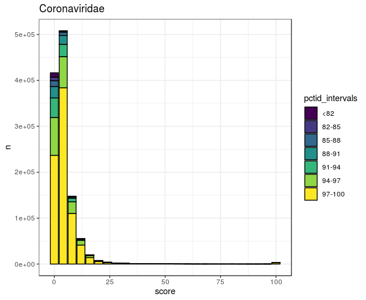

# Tantalus

An R package for exploration of [Serratus](https://github.com/ababaian/serratus) data.


## Upgrade in Progress

We are currently upgrading to a new database server. Some functions may be broken. Please open an [issue](https://github.com/serratus-bio/tantalus/issues) if a problem arises.

## Installation
To install directly from the repo:

```
install.packages("devtools")
library(devtools)

install_github("serratus-bio/tantalus")
```

(Optional) For more efficient data-access, install `aws-cli`and input your credentials with `aws-cli`. Then add the system environmental variables from your R workspace, be sure to use `us-east-1`.

```
Sys.setenv(
  "AWS_ACCESS_KEY_ID" = "my_public_key",
  "AWS_SECRET_ACCESS_KEY" = "my_secret_key",
  "AWS_DEFAULT_REGION" = "us-east-1"
)
```

Note, if you install tantalus with R version <3.6.0, then you first need to install older version of pbkrtest:

```
packageurl <- "http://cran.r-project.org/src/contrib/Archive/pbkrtest/pbkrtest_0.4-7.tar.gz"
install.packages(packageurl, repos=NULL, type="source")
```

## Usage example

To load data with **tantalus** you should import RPostgresSQL and dbplyr packages:

```R
library("tantalus")
library("dbplyr")
library("RPostgreSQL") 

# Connect to Serratus Database
drv <- DBI::dbDriver("PostgreSQL")
con <- DBI::dbConnect(drv, 
                      user="public_reader", 
                      password="serratus",
                      host="serratus-aurora-20210306.cluster-ro-ccz9y6yshbls.us-east-1.rds.amazonaws.com", 
                      port=5432, 
                      dbname="summary")

#with a database
##tbls: __EFMigrationsHistory, AccessionSections, FamilySections, FastaSections, Runs

#get Family table, and Coronaviridae family (and get just specific columns)
x <- readDfSQL(con, "nfamily", family = "Coronaviridae", dataframe = T, 
               columns = c('sra_id', 'score', 'percent_identity', 'family_name'))
               
#get specific SRAs
sras <- c("SRR10144611", "SRR6906297", "SRR6906298",  "SRR6906299", 
          "SRR6906300", "SRR6906303", "SRR3229029", "SRR3229077", 
          "SRR3229078", "SRR3229081")

x_specific <- readDfSQL(con, "nfamily", family = "Coronaviridae", sras = sras, dataframe = T, 
                        ccolumns = c('sra_id', 'score', 'percent_identity', 'family_name'))
```

Plot examples:

```R
#plot pctid histogram with family score intervals
p <- pctidInScoreIntervals(x, family_name = "Coronaviridae", title="Coronaviridae",
                      scale_log = F, bin_scores = F)
p
```


```R
#plot pctid histogram with family score intervals
p <- scoreInPctidIntervals(x, family_name = "Coronaviridae", title="Coronaviridae",
                      scale_log = F, bin_percent = T)
p
```


